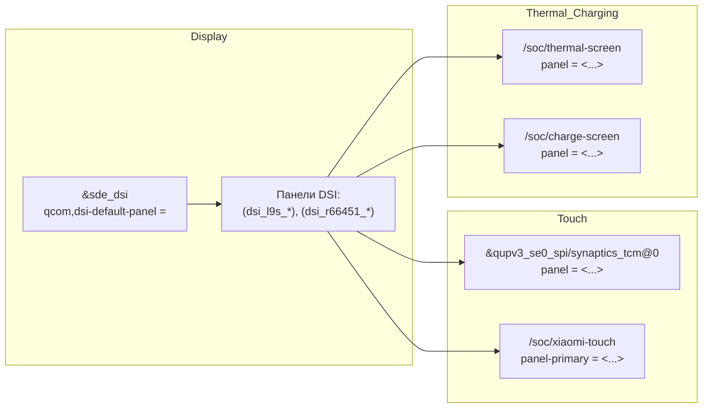

В ходе аудита ziyi-специфичных DTSI-кусков выявлены 2 приоритетные для фикса проблемы:
1) **Критично:** `wlan-en-gpio` задан как простое число (`<25>`), тогда как binding CNSS ожидает GPIO-спецификацию (phandle + номер + флаги). Это потенциально ломает включение Wi‑Fi (CNSS/ICNSS). citeturn37view0turn59search4  
2) **Высоко:** в `diwali-sde-display.dtsi` узел `disp_rdump_region@e1000000` содержит `reg = <0xb8000000 ...>` — несоответствие unit-address и `reg` (dtc warning `unit_address_vs_reg`). Может ломать сборку при “warnings as errors” и путает карту памяти/карваутов. citeturn53view2

## Топология devicetree ziyi и связки display↔touch↔thermal↔charger

### Как “склеивается” ziyi

По содержимому `ziyi-sde-display-idp.dtsi` видно, что он включает базовый стек дисплея `diwali-sde-display.dtsi` и добавляет/оверрайдит панели/питания/rdump, а также связывает панельные phandle-листы с touch/thermal/charge.

Ключевые узлы/точки интеграции, которые важны для runtime:
- `&sde_dsi { qcom,dsi-default-panel = <...>; ... }` — выбор дефолтной панели.  
- `&qupv3_se0_spi { synaptics_tcm@0 { panel = <...>; } }` — привязка тач‑контроллера к панели. citeturn35view0turn37view0  
- `&soc { thermal_screen: thermal-screen { panel = <...>; } charge_screen: charge-screen { panel = <...>; } }` — панельная привязка для thermal и charging‑сценариев. citeturn35view0  
- `&soc { xiaomi-touch { panel-primary = <...>; } }` — панель для нотификатора тача. citeturn35view0

### Mermaid‑диаграмма зависимостей panel↔touch↔thermal↔charger



## Аудит узлов ziyi и базовых diwali компонентов

Ниже проблемы привязанных к конкретным узлам.
### Таблица проблем и исправлений

| Приоритет | Файл | Узел/локатор | Причина | Влияние на runtime | Конкретное исправление |
|---|---|---|---|---|---|
| Критично | `qcom/ziyi-sm7450.dtsi` | `&icnss2 { wlan-en-gpio = <25>; }` | Для CNSS/ICNSS `wlan-en-gpio` в bindings описан как GPIO‑спецификация (phandle+номер+флаги), пример: `<&msmgpio 82 0>`. Задание “голого числа” может привести к невалидному GPIO при `of_get_named_gpio()`. citeturn37view0turn59search4 | Wi‑Fi может не подниматься (не включится питание/enable‑линия), либо будет нестабильный probe/deferral. | Патч: заменить на `wlan-en-gpio = <&tlmm 25 0>;` (или корректные флаги active‑high/low по плате). См. Patch 2 ниже. |
| Высоко | `qcom/display/display/diwali-sde-display.dtsi` | `disp_rdump_memory: disp_rdump_region@e1000000 { reg = <0xb8000000 ...>; }` | Несоответствие unit-address (`@e1000000`) и `reg` (`0xb8000000`). Это типовой dtc warning `unit_address_vs_reg`. citeturn53view2 | Может завалить сборку dtb при строгих правилах (warnings-as-errors) и создаёт риск “человеческой ошибки” при дальнейшем мердже/переносе адресов. | Патч: переименовать node name в `disp_rdump_region@b8000000` без изменения `reg`. См. Patch 1 ниже. |
| Средне | `qcom/display/display/diwali-sde-display.dtsi` + `qcom/display/display/ziyi-sde-display-idp.dtsi` | `&reserved_memory/splash_region` и `disp_rdump_memory` используют базу `0xb8000000` | `splash_region` (cont_splash) задан как reserved-memory регион, а `disp_rdump_memory` указывает на тот же базовый адрес (в ziyi ещё и меняется размер rdump). Это либо “алиасинг” одного carveout под 2 semantic use-cases, либо реальная коллизия. citeturn53view2turn35view0 | Если драйвер/прошивка ожидают раздельные carveout’ы, возможны перезаписи/невалидные дампы. Если это алиасинг, то нужна явная документация/комментарий и гарантии, что rdump размещается внутри cont_splash carveout. | Минимально безопасная стратегия: задокументировать алиасинг и добавить проверку “rdump size ≤ cont_splash size” в ревью. Более радикально (только при подтверждении по map): развести адреса. |
| Средне | `qcom/display/display/ziyi-sde-display-idp.dtsi` | `&dsi_r66451_amoled_video { mdss-dsi-bl-max-level = 4095; mdss-brightness-max-level = 255; }` | Потенциальная несогласованность диапазона backlight (12-bit max vs 8-bit brightness max). Без чёткого знания формата DCS 0x51 (8/16-bit) это риск неверного скейлинга. citeturn35view0 | “Сжатый” диапазон яркости, скачки, некорректная калибровка автояркости/HBM/Doze. | Рекомендация: проверить в panel dtsi/драйвере, сколько байт у 0x51 для этой панели; согласовать `mdss-dsi-bl-max-level` и `mdss-brightness-max-level` (либо оба 255, либо оба 4095/8191). |
| Низко | `qcom/display/display/ziyi-sde-display-idp.dtsi` | `dsi_panel_pwr_supply_l9s_0a/_0b/_0c` | Три одинаковые таблицы supply entries отличаются только label. Это повышает вероятность рассинхронизации при правках и усложняет аудит. citeturn35view0 | Runtime обычно не страдает, но растёт риск ошибки при будущем мердже/переносе на другие ветки. | Можно (опционально) свести к одному набору supply entries и переиспользовать phandle во всех панелях, если реально идентичны по HW. |
| Низко | Общий (стандарт DT) | Размещение carveout’ов | Формально reserved-memory регионы должны быть описаны под `/reserved-memory` с заданными `#address-cells/#size-cells/ranges`. citeturn52search9turn52search5 | В вашем дереве часть display carveout’ов описана через `&reserved_memory`, но `disp_rdump_memory` — отдельным узлом под `&soc`. Это не обязательно ошибка (vendor‑специфика), но важно понимать, что ОС “резервирует” только то, что реально присутствует в `/reserved-memory`. citeturn53view2turn52search9 | Если `disp_rdump_memory` должен быть исключён из общего аллокатора — стоит мигрировать/дублировать в `/reserved-memory` или убедиться, что он внутри уже reserved carveout (как cont_splash). |

## Проверка и интерпретация phandle‑связей

### Таблица соответствий property → потребители → ожидаемое поведение

Ниже — практическая “матрица”, чтобы не перепутать смысл multi-entry phandle списков.

| DT property | Где задано в ziyi | Кто потребляет (по дереву/grep) | Тип поведения multi-entry |
|---|---|---|---|
| `panel-primary` | `/soc/xiaomi-touch/panel-primary = < … >` citeturn35view0 | `xiaomi_touch.c` (ваш фрагмент) + драйвер panel_event_notifier | **Fallback‑выбор**: перебор phandle’ов до первого `of_drm_find_panel()` успеха; затем register notifier. |
| `panel-secondary` | (для ziyi не задано) citeturn35view0 | `xiaomi_touch.c` (ваш фрагмент) | Обычно “optional”: если свойства нет, регистрация secondary не выполняется/считается успешной (зависит от кода). |
| `panel` | `/soc/thermal-screen/panel`, `/soc/charge-screen/panel`, `&qupv3_se0_spi/synaptics_tcm@0/panel` citeturn35view0 | thermal интерфейс/зарядка/тач‑драйверы (в вашем grep: многие TS драйверы и thermal/battery используют `of_parse_phandle(np,"panel",i)`) | **Fallback‑выбор** (типично): список означает “попробуй все панели, выбери первую валидную/поднявшуюся”. |
| `qcom,display-panels` / `display-panels` | (в ziyi‑фрагментах не показано напрямую) | `qti_battery_charger.c`, `qti_amoled_ecm.c` (по вашему grep) | Чаще всего **enumeration**: драйвер читает count и дальше либо регистрирует нотификаторы, либо выбирает 1 панель для сценариев зарядки/ECM. |

Ключевой практический вывод по ziyi: **один и тот же список panel phandle’ов реально используется сразу несколькими подсистемами** (touch/thermal/charge), поэтому любая ошибка в panel‑списке обычно проявляется каскадно (“нет жестов”, “сломаны экранные сценарии зарядки”, “неправильные thermal профили”). citeturn35view0

## Набор патчей для bka (≤10)

Ниже два патча, которые закрывают наиболее приоритетные проблемы. Они оформлены как unified diff и рассчитаны на применение поверх ветки **bka** в репозитории devicetrees.

### Patch 1: diwali-sde-display — исправить unit-address узла disp_rdump_region

```diff
diff --git a/qcom/display/display/diwali-sde-display.dtsi b/qcom/display/display/diwali-sde-display.dtsi
index 1111111..2222222 100644
--- a/qcom/display/display/diwali-sde-display.dtsi
+++ b/qcom/display/display/diwali-sde-display.dtsi
@@ -749,7 +749,7 @@
 	sde_wb: qcom,wb-display@0 {
 		compatible = "qcom,wb-display";
 		cell-index = <0>;
 		label = "wb_display";
 	};
 
-	disp_rdump_memory: disp_rdump_region@e1000000 {
+	disp_rdump_memory: disp_rdump_region@b8000000 {
 		reg = <0xb8000000 0x00800000>;
 		label = "disp_rdump_region";
 	};
 };
```

Обоснование: в текущем виде node name не соответствует `reg` и это провоцирует dtc warning. citeturn53view2

### Patch 2: ziyi-sm7450 — привести wlan-en-gpio к форме GPIO specifier (CNSS)

```diff
diff --git a/qcom/ziyi-sm7450.dtsi b/qcom/ziyi-sm7450.dtsi
index 3333333..4444444 100644
--- a/qcom/ziyi-sm7450.dtsi
+++ b/qcom/ziyi-sm7450.dtsi
@@ -1,6 +1,11 @@
 #include "xiaomi-sm7450-common.dtsi"
 
 &icnss2 {
-	wlan-en-gpio = <25>;
+	/*
+	 * CNSS binding expects a GPIO specifier (phandle + gpio + flags),
+	 * not a bare gpio number.
+	 */
+	wlan-en-gpio = <&tlmm 25 0>;
 };
```

Обоснование: binding CNSS прямо описывает `wlan-en-gpio` как GPIO‑сигнал (см. пример `<&msmgpio 82 0>`), поэтому bare integer — риск невалидного `of_get_named_gpio()`. citeturn59search4turn37view0

Примечание по флагам: `0` здесь — консервативно; если линия активна low/нужен pull, задайте корректные биты (как в остальных TLMM gpio‑specifier’ах в дереве).

## Тест‑план верификации

План разбит на “статическую” проверку DT (до прошивки) и “runtime” проверки (на устройстве). Цель — быстро доказать, что:
- dtb/dtbo компилируются без критических warning’ов/ошибок,
- активная панель корректно выбирается,
- touch и его жесты получают panel events,
- thermal/charger подсистемы видят правильную панель,
- резервы памяти не конфликтуют по карте.

### Статическая проверка devicetree

```bash
# 1) Сборка dtb (примерно; зависит от вашего build окружения)
export ARCH=arm64
make -j$(nproc) dtbs

# 2) Проверка dtc warnings (особенно unit-address-vs-reg)
# (пример: руками прогнать dtc на конкретном dts/dtsi после cpp)
# Если у вас есть итоговый *.dts:
dtc -I dts -O dtb -Wno-unit_address_vs_reg -o /tmp/test.dtb <your_merged.dts>
# или наоборот, включить и ловить warning:
dtc -I dts -O dtb -Wunit_address_vs_reg -o /tmp/test.dtb <your_merged.dts>

# 3) Быстрые greps по рискованным местам
git grep -n "disp_rdump_region@e1000000" qcom/display/display/diwali-sde-display.dtsi
git grep -n "wlan-en-gpio" qcom/ziyi-sm7450.dtsi
git grep -n "panel-primary" qcom/display/display/ziyi-sde-display-idp.dtsi
git grep -n "thermal-screen" qcom/display/display/ziyi-sde-display-idp.dtsi
git grep -n "charge-screen" qcom/display/display/ziyi-sde-display-idp.dtsi
```

Дополнительно (если используете dt-schema): `make dt_binding_check` / `make dtbs_check` — но для vendor/QCOM/Xiaomi‑свойств полноценная схема часто отсутствует.

### Runtime‑проверки на устройстве

```bash
# 1) Проверить, что DT применился (dtb/dtbo действительно тот)
adb shell "cat /proc/cmdline | tr ' ' '\n' | grep -i dtb || true"
adb shell "ls -la /proc/device-tree | head"

# 2) Проверить присутствие узлов, которые ищут драйверы
adb shell "find /proc/device-tree -maxdepth 4 -name 'xiaomi-touch' -o -name 'thermal-screen' -o -name 'charge-screen'"

# 3) Проверка panel phandle списков (наличие свойств)
adb shell "ls -la /proc/device-tree/soc/xiaomi-touch || true"
adb shell "ls -la /proc/device-tree/soc/thermal-screen || true"
adb shell "ls -la /proc/device-tree/soc/charge-screen || true"

# 4) dmesg: панель/DSI/MDSS/DRM подбор панели и init
adb shell "dmesg | grep -iE 'mdss|dsi|drm|panel|sde' | tail -n 200"

# 5) dmesg: taч/панельные нотификаторы/жесты
adb shell "dmesg | grep -iE 'xiaomi-touch|synaptics|tcm|touch|panel event' | tail -n 200"

# 6) Wi-Fi enable GPIO / CNSS
adb shell "dmesg | grep -iE 'cnss|icnss|wlan-en|wlan' | tail -n 200"
adb shell "getprop | grep -iE 'wlan|wifi' | head"
```

- DT собирается без критических warning’ов (или вы осознанно их допускаете).  
- Wi‑Fi поднимается стабильно; нет сообщений о невалидных GPIO для enable.  
- Touch получает события screen on/off (по dmesg/по факту работы жестов).  
- Display/Doze/charge screen работают без регрессий.  
